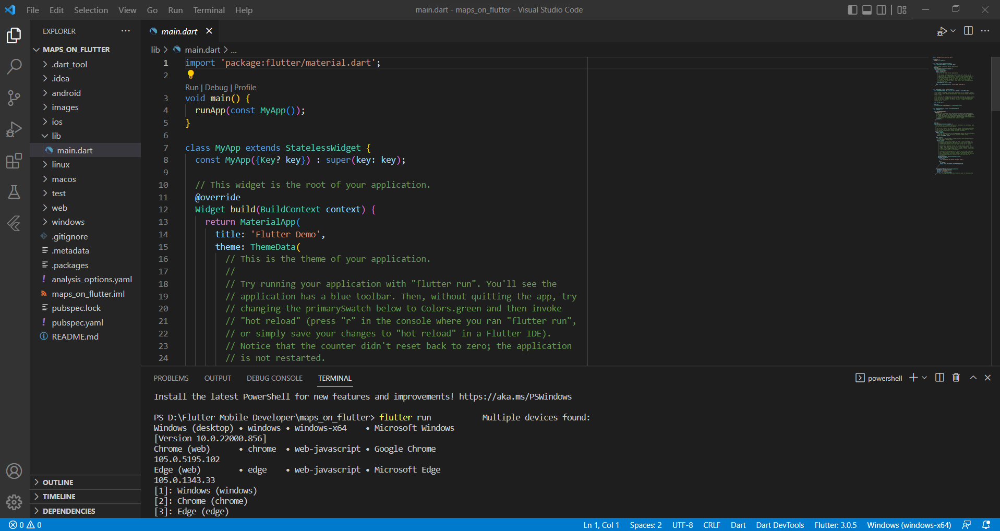
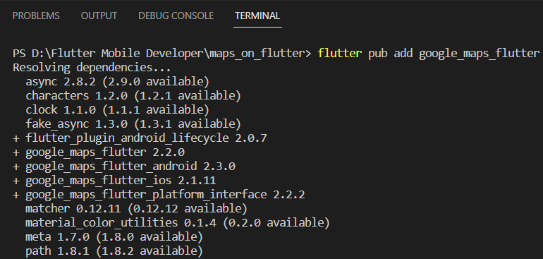
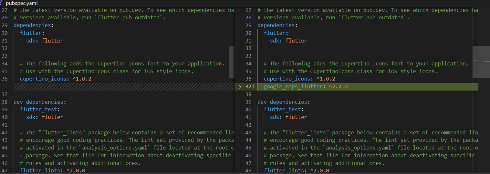
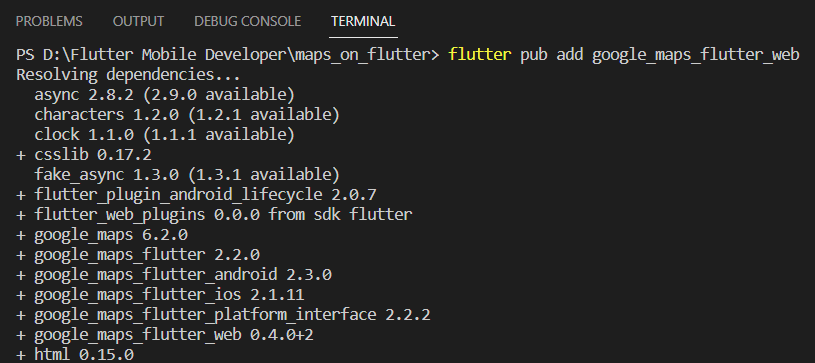
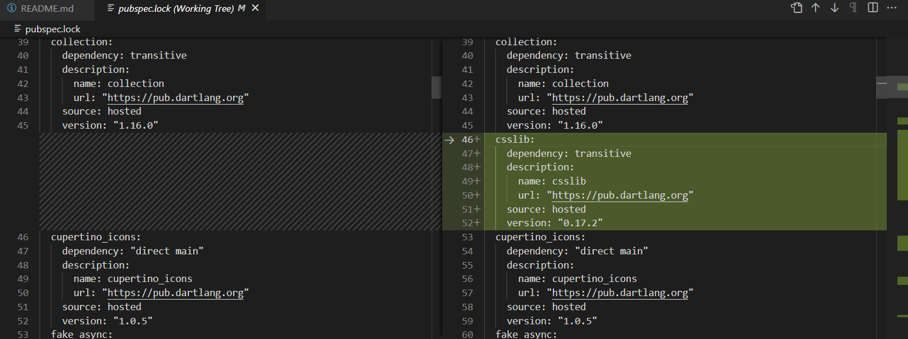
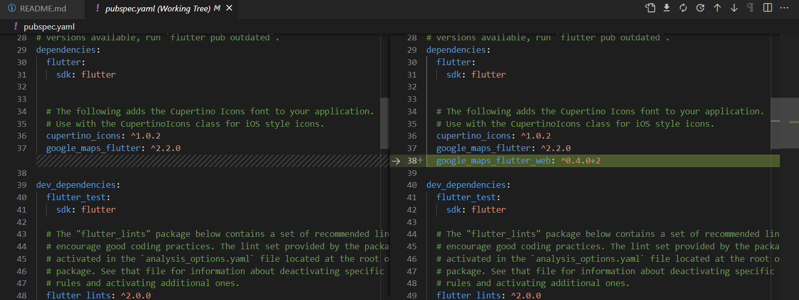
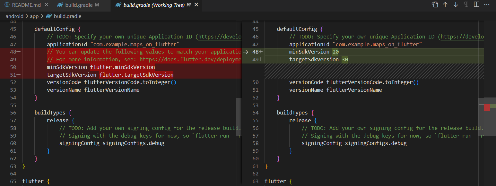
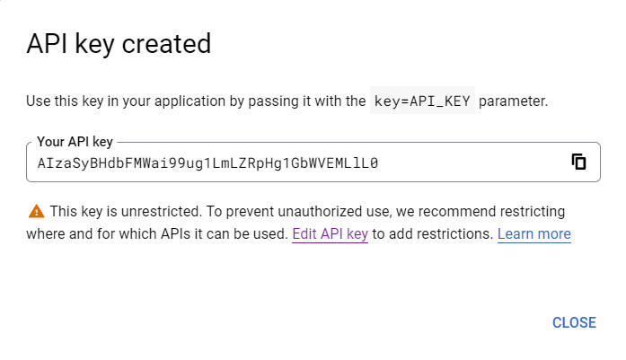
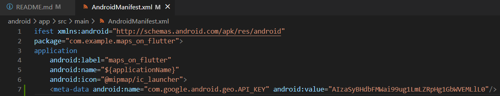

# Laporan Praktikum

## 1. Membuat Project Baru

> _Project_ baru pada praktikum kali ini saya beri nama **maps_on_flutter** sama seperti nama _repository_ di github.

## 2. Menambahkan Plugin Google Maps Flutter sebagai Dependensi 
- Menjalankan perintah **flutter pub add google_maps_flutter** pada terminal untuk menambahkan plugin google maps.

- Running **flutter pub add google_maps_flutter** di terminal

> Ketika perintah **flutter pub add google_maps_flutter** selesai dijalankan, akan terjadi perubahan pada file **pubspec.yaml**.

- Running **flutter pub add google_maps_flutter_web** di terminal

> Menjalankan perintah **flutter pub add google_maps_flutter_web** pada terminal untuk menambahkan plugin google maps versi web.

- Perubahan file **pubspec.lock** dan **pubspec.yaml**

> Ketika perintah **flutter pub add google_maps_flutter_web** selesai dijalankan, akan terjadi perubahan pada file **pubspec.lock** dan **pubspec.yaml**.

## 3. Mengonfigurasi minSDK Android

> Menetapkan minSDK ke 20.

## 4. Menambahkan Google Maps ke aplikasi
- _Generate_ API Key

- Menambahkan API key untuk aplikasi Android

> _Input_ API key pada file **AndroidManifest.xml**.
